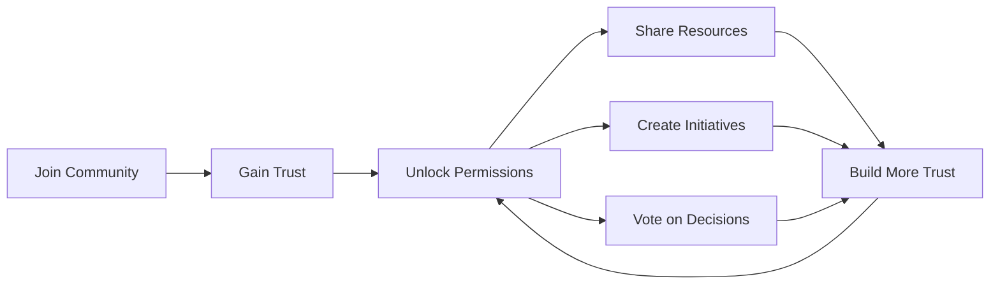

# Welcome to Communities

**Communities** is a community resource sharing platform that enables communities to manage shared resources, build trust relationships, and make collaborative decisions—all without monetary transactions.

## What is Communities?

Communities empowers communities to:

- **Share Resources**: Members share products, services, and resources with the community
- **Build Trust**: Earn permissions through peer validation and community trust
- **Collaborate**: Make decisions together through polls and voting
- **Organize**: Form councils and pools to manage collective resources
- **Track Contributions**: Recognize and value member contributions
- **Resolve Conflicts**: Transparent dispute resolution and mediation

## Core Philosophy

Communities is built on three principles:

1. **Trust-Based Governance** - Members earn permissions through peer trust, not just administrative assignment
2. **Transparency** - All actions are logged and auditable by the community
3. **Flexibility** - Communities configure thresholds and rules to match their values

## Key Features

### :material-account-group: Communities
Independent organizational units with their own members, resources, and governance.

### :material-handshake: Trust System
Peer-to-peer trust system where members earn permissions by gaining community trust.

### :material-gift: Resource Sharing
Share wealth (products, services, resources) with your community without monetary exchange.

### :material-account-supervisor: Councils
Specialized groups that manage resources and create initiatives for the community.

### :material-pool: Pools
Aggregate resources for collective projects and shared planning.

### :material-forum: Community Forum
Discuss ideas, share knowledge, and coordinate with trust-based moderation.

### :material-vote: Voting & Polls
Make collective decisions through community voting.

### :material-chart-line: Value Contributions
Track and recognize economic contributions to the community.

### :material-scale-balance: Dispute Resolution
Transparent mediation system for resolving conflicts fairly.

## Getting Started

New to Communities? Start here:

1. [**Create Your Account**](getting-started/creating-account.md) - Set up your profile
2. [**Join a Community**](getting-started/joining-community.md) - Connect with others
3. [**Understand Trust**](getting-started/understanding-trust.md) - Learn how permissions work
4. [**Share Resources**](guides/share-resources.md) - Start participating

## For Community Admins

Creating or managing a community? Check out:

- [**Creating a Community**](admin/creating-community.md)
- [**Configuring Settings**](admin/configuring-settings.md)
- [**Managing Members**](admin/managing-members.md)
- [**Trust Thresholds**](admin/trust-thresholds.md)

## How It Works

## Need Help?

- Check our [**FAQ**](faq.md) for common questions
- Browse [**How-To Guides**](guides/share-resources.md) for step-by-step instructions
- Visit [**Support**](support.md) for assistance

---

Ready to get started? [Create your account](getting-started/creating-account.md) today!
